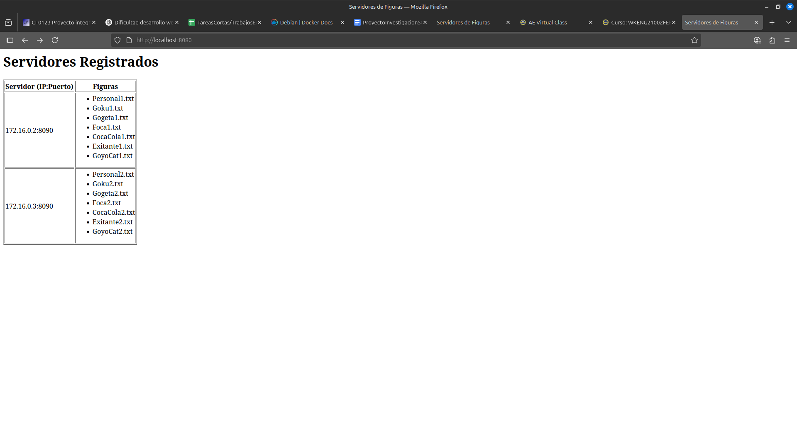

# Importante

Se realizo la prueba de que el servidor cumple con todas las funcionalidades usando contenedores(es lo mismo que ir al aula y probarlo con diferentes vlan) se adjunta imagen con la evidencia que puede manejar diferentes ip.

Los contenedores se levantaron con las ip 172.16.0.2/16 y 172.16.0.3/16 solamente para probar.

Se deja toda la configuracion que se hizo por si se desea probar la veracidad de esto, la parte de como correr los docker es solamente configurando una red, al contenedor que va a levantar el fork server hay que hacerle un puente a nuestro puerto 8080 de la computadora anfrition y los demas servidores son contenedores separados que actuan por si mismos como servidores de figuras.

Ver en la carpeta images la configuracion de los docker, se omitio la parte de docker build.

El servidor ForkServer (también llamado "Book-keeper") es responsable de descubrir, registrar y mantener información sobre los servidores de figuras disponibles en la red. Su funcionamiento se basa en los siguientes mecanismos:

Descubrimiento y registro de servidores
El ForkServer utiliza un hilo de descubrimiento UDP que escucha anuncios de presencia enviados por los servidores de figuras (ASCIIServer).
Cuando un servidor de figuras se inicia, envía periódicamente un mensaje de broadcast UDP con su IP y puerto.
Al recibir este anuncio, el ForkServer registra o actualiza la información del servidor en una estructura interna (por ejemplo, un vector o mapa de estructuras FiguraServerInfo que contiene nombre, IP, puerto y lista de figuras).
Obtención de la lista de figuras
Para conocer las figuras disponibles en cada servidor, el ForkServer envía una solicitud especial (OBJECTS) usando el protocolo ASCII al servidor de figuras correspondiente.
El servidor de figuras responde con la lista de nombres de archivos (figuras) que tiene almacenados.
El ForkServer almacena esta lista asociada a cada servidor en su estructura interna.
Actualización y monitoreo
El ForkServer periódicamente verifica el estado de los servidores registrados, eliminando aquellos que no responden o que han dejado de enviar anuncios.
Cuando un cliente solicita la página principal (por ejemplo, desde un navegador), el ForkServer genera una tabla HTML mostrando todos los servidores registrados y las figuras que tiene cada uno, usando la información almacenada.
Resumen de estructuras usadas
Se utiliza una estructura como FiguraServerInfo para cada servidor, que almacena:
Nombre del servidor
IP
Puerto
Lista de figuras (nombres de archivos)
Todas estas estructuras se mantienen en un vector o mapa protegido por un mutex para acceso concurrente seguro.
Obtención de datos en tiempo real
Cuando un cliente solicita el contenido de una figura específica, el ForkServer reenvía la solicitud al servidor de figuras correspondiente y retorna la respuesta al cliente.

## Interación del bookeper con el ASCIIServer

El bookeper hace broadcast como se indico, el bookeper descubre a las islas con el protocolo ya definidon y los puertos definidos, se implementó el broadcast como se indica en ese documento. El bookeper recibe la solicitud y este tiene guardado las figuras asociadas a la IP y puerto de los diferentes ASCIIServer, se almacenan en un struct y las islas tienen un vector con este struct entonces cuando llega una petición de el usuario, este puede ubicar a la figura y resolver dicha petición, también tiene mecanismos para desconectar los ASCIIServer y para conectarse a ellos.

## Diferenciación con el file system de la entrega del PI

Este file system no tiene un bitmap, si no que los bloques libres se alojan en un espacio en específico del file system, además este es una lista enlazada y crece dinámicamente y da la sensación de almacenamiento infinito.
